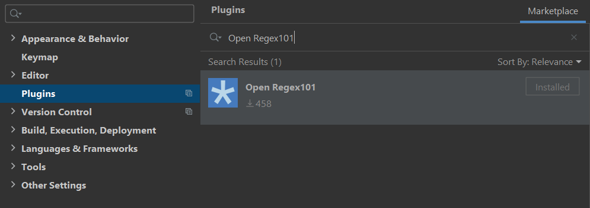

# Regex101 plugin for IntelliJ-based IDEs

This plugin adds an intention to open regular expressions on regex101.com

[](https://plugins.jetbrains.com/plugin/14461-open-regex101/versions)
[](https://plugins.jetbrains.com/plugin/14461-open-regex101)
[](https://plugins.jetbrains.com/plugin/14461-open-regex101/reviews)
[](https://github.com/aesy/regex101-intellij/actions)
[](https://codecov.io/github/aesy/regex101-intellij)
[](https://github.com/aesy/regex101-intellij/blob/master/LICENSE)

## Installation

Download and install the plugin through your IDE or through [the marketplace](https://plugins.jetbrains.com/plugin/14461-open-regex101).



## Usage

Show context actions on a regular expression and select "Open RegExp on regex101.com". 


If the intention doesn't show up, make sure your IDE recognizes the selected text element as a regular expression. 
If it doesn't, use the `Inject language or reference` intention and set it to the correct `RegExp` flavor.

## Development

#### Prerequisites

* [Gradle 8.12+](https://gradle.org/)
* [A Java 21+ Runtime](https://adoptopenjdk.net/)

#### Build

To compile and package the plugin, simply issue the following command:

```sh
$ ./gradlew buildPlugin
```

This will create a zip located in `build/distributions/`.

#### Test

Run the tests as you would in any other gradle project:

```sh
$ ./gradlew test
```

#### Run

To run the plugin from the command line, the following command can be used:

```sh
$ ./gradlew runIde
```

This will start IntelliJ Ultimate with all necessary plugins loaded. Logs are located at 
`build/idea-sandbox/system/log/idea.log`.

## Contribute
Use the [issue tracker](https://github.com/aesy/regex101-intellij/issues) to report bugs or make feature requests. 

## License
MIT, see [LICENSE](/LICENSE) file.
